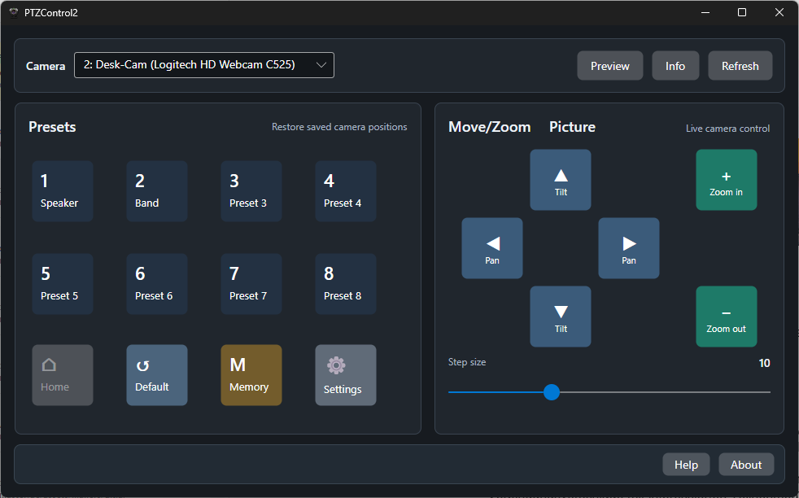

# PTZControl2 GUI

`PTZControl2` is the modern Windows GUI in this fork. It is designed for live
camera operation where the classic GUI is too small, too dense, or too hard to
use repeatedly during production work.

## Why PTZControl2 exists

The original `PTZControl.exe` remains available for compatibility, but
`PTZControl2` provides a more operator-friendly control surface:

- Larger preset, home, default, pan/tilt, and zoom buttons.
- A clearer layout for live operation on smaller control displays.
- Light and dark theme support.
- A modern Settings dialog with camera, movement, preset, compatibility, and
  appearance sections.
- Better status feedback for success and warning states.

## Main features

- Camera selection by slot with compact names and full device path tooltips.
- Camera slot aliases and preset names.
- Per-camera movement settings such as pan/tilt inversion.
- Per-camera compatibility options for standard UVC controls versus Logitech
  extension controls.
- Optional Windows live preview window for checking the selected camera image.
- Camera monitor window with current zoom, pan, tilt, and picture-control
  values.
- Picture controls for supported cameras: brightness, contrast, sharpness, and
  saturation.
- Windows device display-name rename support with UAC elevation when required.

## Platform scope

PTZControl2 is currently promoted as a Windows GUI application. The project uses
Avalonia, but Linux/macOS GUI behavior is not part of the supported release
scope yet because camera control, live preview, and device rename features are
currently Windows-oriented.

## Relation to PTZControlConsole

Use `PTZControl2` for interactive operation. Use `PTZControlConsole` for
automation from scripts, Stream Deck, Bitfocus Companion, batch files, and other
external control systems.
