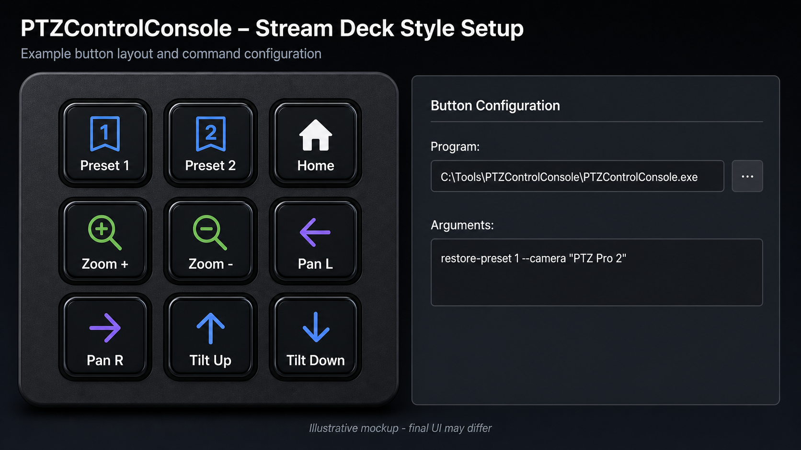

# Using PTZControlConsole with Stream Deck

`PTZControlConsole` can be used from Stream Deck buttons by running command-line
actions. This is useful when a camera action should be triggered from a physical
button without opening the PTZControl Windows GUI.



_Illustrative mockup. The exact Stream Deck action UI depends on the installed
Stream Deck software version and plugins._

## Preparation

1. Download the matching Windows console package from the GitHub release page.
2. Extract the ZIP file to a stable folder, for example:

```text
C:\Tools\PTZControlConsole
```

3. Open a terminal in that folder and verify that the camera is visible:

```powershell
.\PTZControlConsole.exe list-devices
.\PTZControlConsole.exe cam-device-info --camera "PTZ Pro 2"
```

Use `--device-path` instead of `--camera` when camera names are ambiguous.

## Recommended Stream Deck action style

Create a Stream Deck button that runs a command or starts a program. The exact
action name depends on the Stream Deck software and installed plugins. Use the
full path to `PTZControlConsole.exe` and pass the required arguments.

Example command:

```text
C:\Tools\PTZControlConsole\PTZControlConsole.exe restore-preset 1 --camera "PTZ Pro 2"
```

If the Stream Deck action separates program and arguments, use:

Program:

```text
C:\Tools\PTZControlConsole\PTZControlConsole.exe
```

Arguments:

```text
restore-preset 1 --camera "PTZ Pro 2"
```

## Useful button examples

Restore preset 1:

```text
restore-preset 1 --camera "PTZ Pro 2"
```

Move to the Logitech home position:

```text
restore-home --target move --camera "PTZ Pro 2"
```

Zoom in by 10 percent:

```text
zoom-relative 10 --mode percent --camera "PTZ Pro 2"
```

Zoom out by 10 percent:

```text
zoom-relative -10 --mode percent --camera "PTZ Pro 2"
```

Move pan right by 10 percent:

```text
move-relative --mode percent --pan 10 --camera "PTZ Pro 2"
```

Move pan left by 10 percent:

```text
move-relative --mode percent --pan -10 --camera "PTZ Pro 2"
```

Set a unique Windows DirectShow camera name:

```text
set-directshow-camera-name --device-path "DevicePath" --friendlyname "Stage Left" --acknowledge-warning
```

Only use the DirectShow rename command intentionally. It writes to the Windows
HKLM registry and requires administrator rights.

## Camera selector choices

Use one selector per button:

```text
--camera "NamePart"
--device-path "DevicePath"
--slot 1
```

`--camera` is readable and works well when camera names are unique.
`--device-path` is verbose but precise. `--slot` is short, but depends on the
camera enumeration order.
